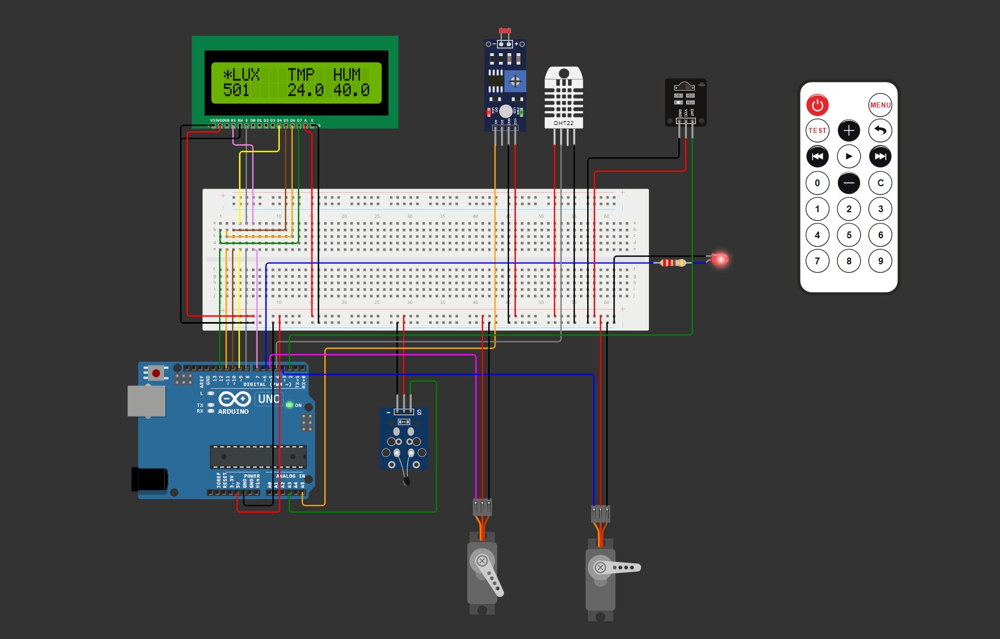
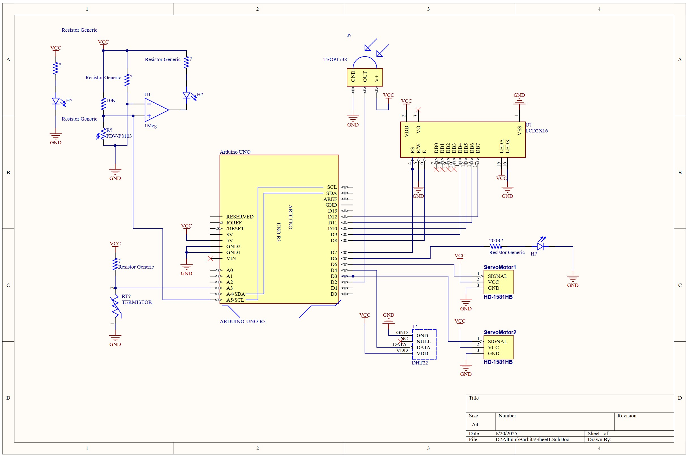

# Actividad 2

## Escandallo

- Arduino Uno
- LCD 16x2
- NTC
- DHT 22
- LDR
- LED
- Resistencia de 220 Ohm
- 2x Servo

## Esquema




## Código

### sketch.ino

El fichero `sketch.ino` contiene las funciones de entrada del programa:

- `setup`: Se llama únicamente una vez
- `loop`: Se llama de forma repetida durante el funcionamiento

Antes de llegar a las funciones anteriormente mencionadas, se cargan las librerías y ficheros del proyecto:

- **Librerías**:
  - bblanchon/ArduinoJson @ 7.4.1
  - adafruit/DHT sensor library @ ^1.4.6
  - adafruit/Adafruit LiquidCrystal @ ^2.0.4
  - arduino-libraries/Servo @ 1.2.2
- **Ficheros del proyecto**:
  - Variables: Contiene las variables globales a emplear por el programa
  - SensorsEnvironment: Contiene las funciones encargadas de leer los sensores encargados de obtener información del entorno
  - SensorsBattery: Contiene las funciones encargadas de leer los sensores encargados de obtener información de la batería
  - BatteryTemperatureControlServos: Contiene las funciones encargadas de interactuar con los servos que regulan la temperatura de la batería
  - LED: Contiene las funciones para calcular el brillo que debe tener el LED
  - LCD: Contiene las funciones para actualizar el contenido mostrado por el LCD que actúa como HMI con el usuario

En la función `setup` se inicializan las distintas variables y componentes del programa, más concretamente:

- Se establece el puerto serie a 115200 baudios
- Se inicializa el LCD (indicando que es del tipo 16 columnas por 2 filas), el DHT, los tipos de PIN de LDR y del NTC y los puertos en los que están conectados los servos
- Se establece el LED en apagado de forma inicial, se establece a 0 grados ambos servos de forma inicial y se muestra en el LCD la información inicial acorde a como se inicializan las variables.

En la función `loop` se realizan las llamadas a las distintas funciones con las que se obtiene información de los sensores y se mandan ordenes a los actuadores. Destacar que se realiza un ciclo cada `500ms` y que el contenido mostrado por el LCD se actualiza `1 vez por segundo`.

Finalmente se encuentra la función encargada de enviar por el puerto serie la lectura realizada de los sensores en formato `JSON`.

```c++
#include <ArduinoJson.h>
#include <DHT.h>
#include <Adafruit_LiquidCrystal.h>
#include <Servo.h>

#include <modules/Variables.ino>
#include <modules/SensorsEnvironment.ino>
#include <modules/SensorsBattery.ino>
#include <modules/BatteryTemperatureControlServos.ino>
#include <modules/LED.ino>
#include <modules/LCD.ino>

void setup() {
  // put your setup code here, to run once:
  Serial.begin(115200);

  // Initialize hardware
  lcd.begin(16, 2);
  dht.begin();
  pinMode(LDR_PIN, INPUT);
  pinMode(NTC_PIN, INPUT);
  servoCool.attach(5);
  servoHeat.attach(3);

  // Initialize Battery Heating Resistance, LED and LCD
  analogWrite(LED_PIN, 0);

  servoCool.write(0);
  servoHeat.write(0);

  clearLCDRow(0);
  clearLCDRow(1);
  lcd.setCursor(0, 0);
  lcd.print(" LUX   TMP  HUM ");
  lcd.print("0      0.0  0.0 ");
}

void loop() {
  // put your main code here, to run repeatedly:
  float environmentLux = readEnvironmentLuminosity();
  float environmentTemperature = readEnvironmentTemperature();
  float environmentHumidity = readEnvironmentHumidity();

  float batteryTemperature = readBatteryTemperature();

  // Send lecture through serial
  sendData(environmentLux, environmentTemperature, environmentHumidity, batteryTemperature);

  // Enable Battery Heating Resistance if needed
  int batteryHeatingServoStatus = setBatteryTemperatureControlServosPosition(batteryTemperature);

  // Update LED Brightness
  if (evenCycle) {
    long ledBrightness = getLEDBrightness(environmentLux);
    analogWrite(LED_PIN, ledBrightness);
  } else {
    analogWrite(LED_PIN, 0);
  }

  // Update LCD data
  if (evenCycle) {
    updateLCD(environmentLux, environmentTemperature, environmentHumidity, batteryHeatingServoStatus);
  }

  // Toggle evenCycle variable
  evenCycle = !evenCycle;

  delay(500);
}

//
void sendData(float environmentLux, float environmentTemperature, float environmentHumidity, float batteryTemperature) {
  String s = "";

  // Create JSON document
  StaticJsonDocument<200> doc;
  doc["environment"]["lux"] = environmentLux;
  doc["environment"]["temperature"] = environmentTemperature;
  doc["environment"]["humidity"] = environmentHumidity;
  doc["battery"]["temperature"] = batteryTemperature;

  // Serialize JSON document to string
  serializeJson(doc, s);

  Serial.println(s);
}
```

### Variables.ino

En este fichero se definen tanto las constantes con las que se parametriza el funcionamiento del sistema como las variables que emplea el programa para mantener el estado entre ciclos.

```c++
// Define LCD variables
Adafruit_LiquidCrystal lcd(7, 8, 9, 10, 11, 12);

// Define DHT variables
DHT dht(4, DHT22);

// Define servo variables
Servo servoCool;
Servo servoHeat;

// Define LDR variables
const int LDR_PIN = A5;
const float LDR_GAMMA = 0.7;
const float LDR_RL10 = 50;

// Define NTC variables
const int NTC_PIN = A3;
const float NTC_BETA = 3950;

// Define LED variables
const int LED_PIN = 6;
const long LED_MIN_ENVIRONMENT_LUX = 10;
const long LED_MAX_ENVIRONMENT_LUX = 10000;
const long LED_MIN_BRIGHTNESS = 10;
const long LED_MAX_BRIGHTNESS = 255;

float lcdLux = 0;
float lcdTmp = 0;
float lcdHum = 0;

// Define BATTERY variables (hysteresis)
const int BATTERY_TMP = 20;
const int BATTERY_TMP_MIN_DIFF = 3;
const int BATTERY_TMP_MAX_DIFF = 9;

bool evenCycle = false;
```

### SensorsEnvironment.ino

Este fichero contiene las funciones con la lógica para obtener el valor de los sensores encargados de obtener el estado de la meteorología alrededor de la boya climática.

```c++
float readEnvironmentLuminosity() {
  int analogValue = analogRead(LDR_PIN);
  float voltage = analogValue / 1024. * 5;
  float resistance = 2000 * voltage / (1 - voltage / 5);
  float lux = pow(LDR_RL10 * 1e3 * pow(10, LDR_GAMMA) / resistance, (1 / LDR_GAMMA));

  return lux;
}

float readEnvironmentTemperature() {
  float temperature = dht.readTemperature();

  return temperature;
}

float readEnvironmentHumidity() {
  float humidity = dht.readHumidity();

  return humidity;
}
```

### SensorsBattery.ino

Este fichero contiene la función con la lógica para realizar la lectura del estado de la batería.

```c++
float readBatteryTemperature() {
  int analogValue = analogRead(NTC_PIN);
  float celsius = 1 / (log(1 / (1023. / analogValue - 1)) / NTC_BETA + 1.0 / 298.15) - 273.15;

  return celsius;
}
```

### BatteryTemperatureControlServos.ino

Este fichero contiene la lógica para establecer el ángulo de apertura de los servomotores conectados a las electro válvulas encargadas de dejar pasar el fluido enfriador y calentador de la batería para que su temperatura sea óptima en cualquier instante.

```c++
/**
 * Function to set angle to the corresponding servo motor
 * in charge of open or close the electronic valve for
 * heating and cooling the battery
 *
 * @param float batteryTemperature: Current temperature of the battery
 * @return int: 0: No EV opened, 1: Cool EV opened, 2: Heating EV opened.
 */
int setBatteryTemperatureControlServosPosition(float batteryTemperature) {
  if (batteryTemperature > BATTERY_TMP + BATTERY_TMP_MIN_DIFF) {
    // Cool
    const float angle = map(batteryTemperature, BATTERY_TMP + BATTERY_TMP_MIN_DIFF, BATTERY_TMP + BATTERY_TMP_MAX_DIFF, 0, 180);
    servoCool.write(angle);
    servoHeat.write(0);

    return 1;
  } else if (batteryTemperature < BATTERY_TMP - BATTERY_TMP_MIN_DIFF) {
    // Heat
    const float angle = map(batteryTemperature, BATTERY_TMP - BATTERY_TMP_MIN_DIFF, BATTERY_TMP - BATTERY_TMP_MAX_DIFF, 0, 180);

    servoCool.write(0);
    servoHeat.write(angle);

    return 2;
  } else {
    servoCool.write(0);
    servoHeat.write(0);

    return 0;
  }
}
```

### LED.ino

Este fichero contiene las funciones auxiliares relacionadas con el LED de balizamiento de la boya.

```c++
long getLEDBrightness(float environmentLux) {
  const long brightness = environmentLux > LED_MAX_ENVIRONMENT_LUX ? LED_MAX_BRIGHTNESS : map(environmentLux, LED_MIN_ENVIRONMENT_LUX, LED_MAX_ENVIRONMENT_LUX, LED_MIN_BRIGHTNESS, LED_MAX_BRIGHTNESS);
  return LED_MIN_BRIGHTNESS + LED_MAX_BRIGHTNESS - brightness;
}
```

### LCD.ino

Este fichero contiene las funciones que alteran el contenido del LCD dependiendo de las variaciones de las lecturas realizadas por los distintos sensores.

```c++
void updateLCD(float environmentLux, float environmentTemperature, float environmentHumidity, int batteryHeatingServoStatus) {
  // Set Environment Luminosity on LCD
  lcd.setCursor(0, 1);
  if (environmentLux > 99999 && lcdLux != 99999) {
    lcd.println("99999");
    lcdLux = 99999;
  } else if (environmentLux != lcdLux) {
    lcd.println(environmentLux, 0);
    lcdLux = environmentLux;
  }

  // Set Environment Temperature on LCD
  if (environmentTemperature != lcdTmp) {
    if (environmentTemperature < 0) {
      lcd.setCursor(6, 1);
    } else {
      lcd.setCursor(7, 1);
    }
    lcd.println(environmentTemperature, 1);

    lcdTmp = environmentTemperature;
  }

  // Set Environment Humidity on LCD
  if (environmentHumidity != lcdHum) {
    lcd.setCursor(12, 1);
    if (environmentHumidity != 100) {
      lcd.println(environmentHumidity, 1);
    } else {
      lcd.println(environmentHumidity, 0);
    }

    lcdHum = environmentHumidity;
  }

  switch (batteryHeatingServoStatus) {
    case 0:
      lcd.setCursor(0, 0);
      lcd.print(" ");
      lcd.setCursor(15, 0);
      lcd.print(" ");
      break;
    case 1:
      lcd.setCursor(0, 0);
      lcd.print("*");
      lcd.setCursor(15, 0);
      lcd.print(" ");
      break;
    case 2:
      lcd.setCursor(0, 0);
      lcd.print(" ");
      lcd.setCursor(15, 0);
      lcd.print("*");
      break;
  }
}

// Clear LCD row
void clearLCDRow(int row) {
  lcd.setCursor(0, row);
  lcd.print("                ");
}
```

# Actividad 2 - Desarrollo

## Compilar el código

Este es un proyecto [PlatformIO](https://platformio.org). Para compilarlo, [instalar PlatformIO](https://docs.platformio.org/en/latest/core/installation/index.html), y después ejecutar el siguiente comando:

```bash
pio run
```

## Simular el proyecto

Para simular el proyecto, instalar [Wokwi for VS Code](https://marketplace.visualstudio.com/items?itemName=wokwi.wokwi-vscode). Abrir el directorio del proyecto en Visual Studio Code, presionar **F1** y seleccionar `Wokwi: Start Simulator`.
